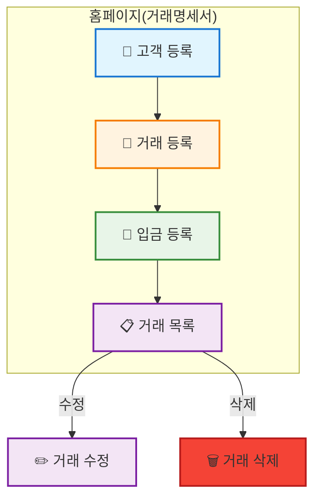
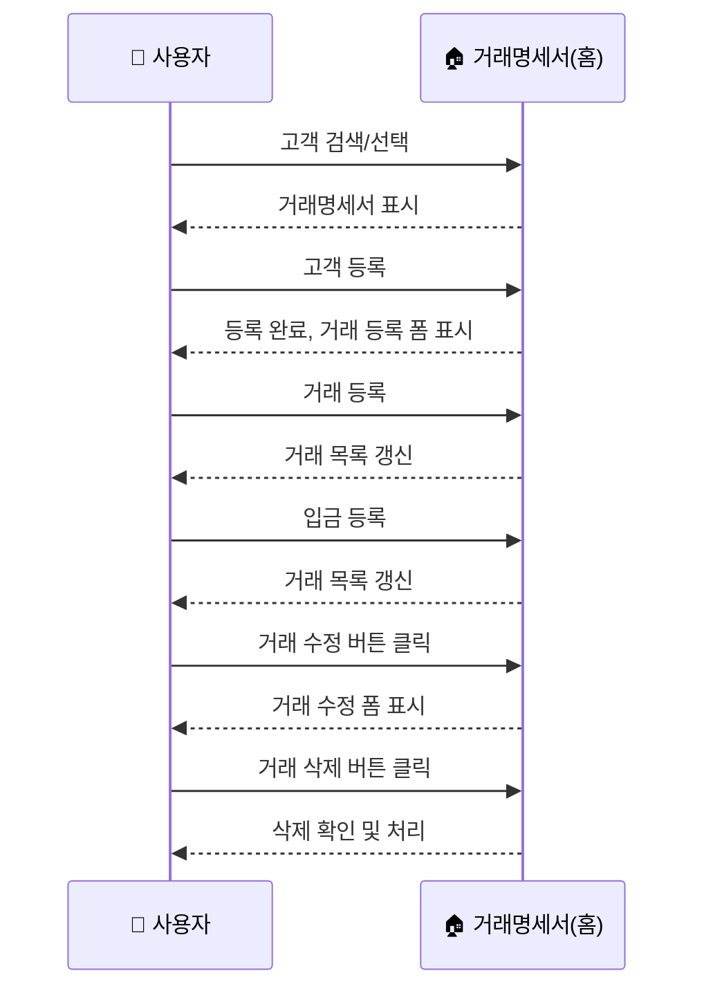

# 거래명세서(Statement) 페이지 통합/개선 PRD

## 1. 목적
- 거래명세서 페이지를 홈페이지(메인)로 지정
- 고객 등록/거래 등록/입금 등록/거래 수정/거래 삭제를 모두 한 화면에서 처리
- 고객 전체검색(자동완성) 기능 추가
- 시니어 친화적 UI/UX, 실시간 동기화, 모달 기반 입력 등 적용

## 2. 시스템 구조



## 3. 주요 요구사항

### 3.1 고객 전체검색(자동완성)
- 고객명, 전화번호 등으로 실시간 검색
- 2글자 이상 입력 시 자동완성 리스트(최대 20건)
- 키보드 ↑↓/마우스 클릭으로 선택
- 선택 시 해당 고객의 거래명세서 표시
- 최근 선택/자주 쓰는 고객 우선 노출(선택)

### 3.2 고객 등록
- 거래명세서(홈)에서 바로 신규 고객 등록(모달)
- 등록 후 해당 고객 자동 선택, 거래 등록 폼 활성화

### 3.3 거래 등록
- 선택된 고객에 대해 거래 등록 폼 제공
- 등록 후 거래 목록 즉시 갱신

### 3.4 입금 등록
- 각 거래 행(또는 하위 입금내역)에서 입금 등록/수정/삭제 가능
- 입금 등록 시 거래 잔액/상태 실시간 반영

### 3.5 거래 수정/삭제
- 거래명세서 테이블 각 행에 ✏️수정/🗑️삭제 버튼 제공
- 수정 클릭 시 거래 수정 폼(모달)
- 삭제 클릭 시 확인 후 즉시 삭제 및 목록 갱신

### 3.6 UI/UX
- 시니어 친화적 대형 버튼/카드/색상/아이콘 적용
- 실시간 동기화(즉시 반영) 보장
- 모달 기반 입력, 페이지 이동 최소화

## 4. 데이터/사용자 흐름



## 5. 기술적 구현 예시

```typescript
// 고객 검색 입력 상태
const [search, setSearch] = useState('');
const [filteredCustomers, setFilteredCustomers] = useState<Customer[]>([]);

useEffect(() => {
  if (search.length < 2) {
    setFilteredCustomers([]);
    return;
  }
  setFilteredCustomers(
    customers.filter(c =>
      c.name.includes(search) ||
      c.mobile?.replace(/-/g, '').includes(search.replace(/-/g, ''))
    ).slice(0, 20)
  );
}, [search, customers]);

<input
  type="text"
  className="border rounded px-4 py-2 text-lg"
  placeholder="고객명/전화번호로 검색"
  value={search}
  onChange={e => setSearch(e.target.value)}
/>
{filteredCustomers.length > 0 && (
  <ul className="absolute bg-white border rounded shadow-lg z-10">
    {filteredCustomers.map(c => (
      <li
        key={c.id}
        className="px-4 py-2 hover:bg-blue-100 cursor-pointer"
        onClick={() => { setSelectedCustomer(c.id); setSearch(''); }}
      >
        {c.name} <span className="text-gray-500 text-sm">{c.mobile}</span>
      </li>
    ))}
  </ul>
)}
```

## 6. 체크리스트
- [x] 고객명/전화번호 실시간 검색
- [x] 자동완성 리스트
- [x] 키보드/마우스 선택 지원
- [x] 검색 결과 없을 때 안내
- [x] 시니어 친화적 대형 입력/리스트
- [x] 거래명세서에서 고객/거래/입금 등록·수정·삭제 모두 가능
- [x] 각 행에 수정/삭제 버튼
- [x] 실시간 동기화
- [x] 시니어 친화적 UI
- [x] 모달 기반 입력
- [x] 페이지 이동 최소화 