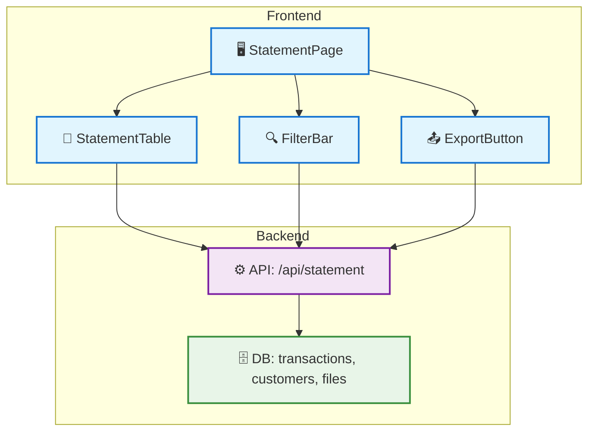
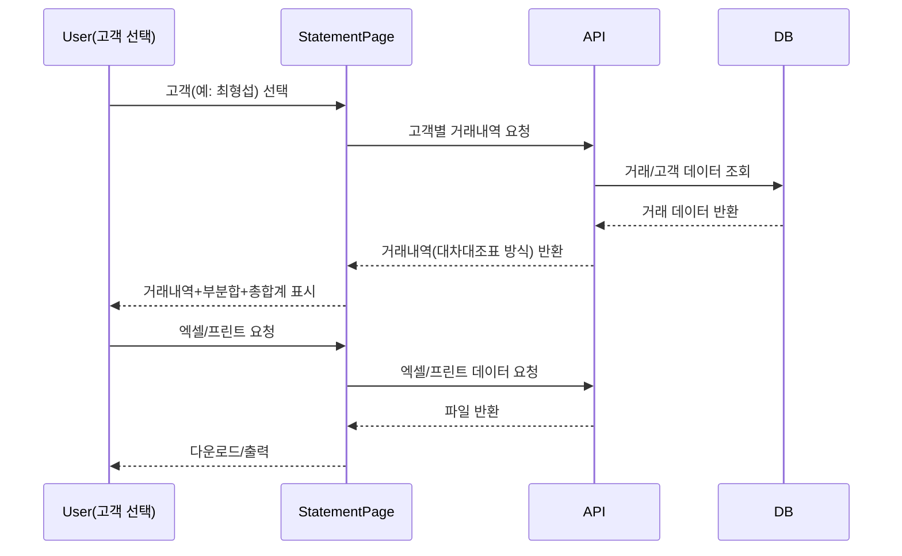

# 거래명세서(Statement) 페이지 PRD

---

## 🏗️ 거래명세서 아키텍처

### 📋 시스템 구성 요소

```mermaid
graph TB
    subgraph "Frontend"
        A[🖥️ StatementPage]
        B[📄 StatementTable]
        C[🔍 FilterBar]
        D[📤 ExportButton]
    end
    subgraph "Backend"
        E[⚙️ API: /api/statement]
        F[🗄️ DB: transactions, customers, files]
    end
    A --> B
    A --> C
    A --> D
    B --> E
    C --> E
    D --> E
    E --> F
    style A fill:#e1f5fe,stroke:#1976d2,stroke-width:2px
    style B fill:#e1f5fe,stroke:#1976d2,stroke-width:2px
    style C fill:#e1f5fe,stroke:#1976d2,stroke-width:2px
    style D fill:#e1f5fe,stroke:#1976d2,stroke-width:2px
    style E fill:#f3e5f5,stroke:#7b1fa2,stroke-width:2px
    style F fill:#e8f5e8,stroke:#388e3c,stroke-width:2px
```

#### 1️⃣ 프론트엔드
- **역할**: 거래명세서 조회, 필터, 내보내기 UI 제공
- **구성요소**: StatementPage, StatementTable, FilterBar, ExportButton
- **책임**: 사용자 입력 처리, 데이터 표시, 내보내기

#### 2️⃣ 백엔드
- **역할**: 거래명세서 데이터 제공, 필터 처리, 파일 생성
- **구성요소**: /api/statement API, DB 테이블
- **책임**: 데이터 쿼리, 엑셀/PDF 등 파일 생성

### 🔄 데이터 흐름

```mermaid
sequenceDiagram
    participant U as User(고객 선택)
    participant F as StatementPage
    participant B as API
    participant D as DB
    U->>F: 고객(예: 최형섭) 선택
    F->>B: 고객별 거래내역 요청
    B->>D: 거래/고객 데이터 조회
    D-->>B: 거래 데이터 반환
    B-->>F: 거래내역(대차대조표 방식) 반환
    F-->>U: 거래내역+부분합+총합계 표시
    U->>F: 엑셀/프린트 요청
    F->>B: 엑셀/프린트 데이터 요청
    B-->>F: 파일 반환
    F-->>U: 다운로드/출력
```

---

## 1. 개요
- **목적**: 고객별 거래내역을 한눈에 확인하고, 엑셀/출력 등으로 내보낼 수 있는 거래명세서 제공
- **주요 기능**:
  - 거래명세서 테이블(고객, 거래일, 품목, 대변(매출), 차변(입금), 잔액, 비고)
  - 고객별 부분합(합계) 표시
  - 기간/고객/상태별 필터
  - 엑셀/출력 내보내기(부분합/총합 포함)
  - 시니어 친화적 대형 UI
  - **고객정보/거래내역은 DB에서 실시간 조회**
  - **기존 페이지(고객, 거래, 대시보드 등)는 변경하지 않음**

## 2. 요구사항 목록
### [필수]
- 거래명세서 테이블(고객, 거래일, 품목, 대변(매출), 차변(입금), 잔액, 비고)
- 고객별 부분합(합계) 행 자동 생성(예: 최형섭 고객의 합계)
- 기간/고객/상태별 필터
- 엑셀 다운로드, 인쇄(부분합/총합 포함)
- 반응형, 대형 텍스트, 명확한 색상 구분
- 접근성(키보드, 스크린리더)
- **고객정보/거래내역은 DB에서 가져옴**

### [선택]
- PDF 내보내기
- 거래 상세 모달
- 다크모드 지원

## 3. 주요 화면 설계
- **상단**: 제목(📑 거래명세서), 필터바(기간, 고객, 상태)
- **중앙**: 거래명세서 테이블(카드 스타일, 대형 셀, 대변/차변 컬럼)
- **하단**: 고객별 부분합(합계) 행, 엑셀/출력 버튼(크고 명확한 색상)
- **모바일**: 세로 스크롤, 버튼 하단 고정

## 4. API/DB 설계
### API
- `GET /api/statement?customer=...&from=...&to=...&status=...`
  - 응답: 거래명세서 데이터(JSON, 고객별 부분합 포함)
- `GET /api/statement/export?type=xlsx|pdf&...`
  - 응답: 파일 다운로드(부분합/총합 포함)

### DB
- **transactions**: id, customer_id, date, item, credit(대변), debit(차변), balance, note, status
- **customers**: id, name, phone
- **files**: id, transaction_id, url

## 5. 체크리스트
- [ ] PRD 요구사항 모두 구현
- [ ] 시니어 친화적 UI 적용(폰트, 색상, 버튼)
- [ ] 반응형/접근성 테스트
- [ ] 엑셀/출력 정상 동작(부분합/총합 포함)
- [ ] API/DB 스키마 일치
- [ ] 코드 리뷰 및 문서화

---

## 📋 예시: 최형섭 고객 거래명세서

| 일자       | 적요     | 대변(매출) | 차변(입금) | 잔액   | 비고   |
|------------|----------|------------|------------|--------|--------|
| 2024-06-01 | 트랙터   | 5,000,000  |            | 5,000,000 |      |
| 2024-06-10 | 입금     |            | 2,000,000  | 3,000,000 |      |
| 2024-06-20 | 부품구매 | 500,000    |            | 3,500,000 |      |
| 2024-06-25 | 입금     |            | 1,000,000  | 2,500,000 |      |
| **합계**   |          | 5,500,000  | 3,000,000  | 2,500,000 |      |

- **고객별 부분합(합계) 행**: 해당 고객의 거래 합계(매출, 입금, 잔액 등) 테이블 하단에 표시
- **엑셀/프린트**: 위 구조 그대로 다운로드/출력
- **고객정보/거래내역은 DB에서 실시간 조회**
- **기존 페이지는 변경하지 않음** 