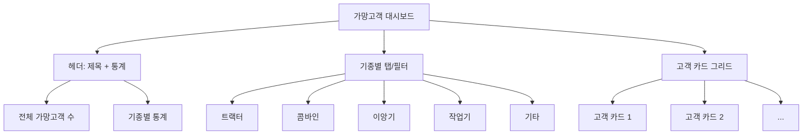

# 📋 가망고객 관리 기능 PRD (Product Requirements Document)

## 📖 목차
1. [개요](#1-개요)
2. [기능 요구사항](#2-기능-요구사항)
3. [데이터베이스 설계](#3-데이터베이스-설계)
4. [UI/UX 설계](#4-uiux-설계)
5. [API 설계](#5-api-설계)
6. [구현 체크리스트](#6-구현-체크리스트)

---

## 1. 개요

### 1.1 목적
농기계 판매 업체에서 잠재 고객(가망고객)을 체계적으로 관리하고, 기종별로 분류하여 효율적인 영업 활동을 지원하는 기능을 제공합니다.

### 1.2 핵심 가치
- **기종별 가망고객 관리**: 트랙터/콤바인/이앙기/작업기/기타로 분류하여 한눈에 파악
- **현재보유 기종 추적**: 고객이 현재 보유한 기종 정보를 기록하여 맞춤형 제안 가능
- **가망기종 등록**: 고객이 구매를 고려하는 기종 정보를 쉽게 입력

---

## 2. 기능 요구사항

### 2.1 가망고객 대시보드 페이지

#### 2.1.1 페이지 구조
- **경로**: `/prospects`
- **레이아웃**: 대시보드 형태의 카드 그리드
- **기종별 탭/섹션**: 트랙터, 콤바인, 이앙기, 작업기, 기타

#### 2.1.2 기능
1. **기종별 필터링**
   - 트랙터, 콤바인, 이앙기, 작업기, 기타로 분류 표시
   - 각 기종별 고객 수 표시
   - 기종별 카드 그리드 레이아웃

2. **고객 카드 정보**
   - 고객명, 연락처
   - 현재보유 기종 (예: 트랙터 / L47H)
   - 가망기종 (예: 트랙터 / MR877)
   - 등록일

3. **검색 및 필터**
   - 고객명, 연락처로 검색
   - 기종별 필터링
   - 정렬 기능 (등록일순, 이름순)

### 2.2 고객 등록 모달 확장

#### 2.2.1 추가 입력 필드
1. **가망기종 선택**
   - 드롭다운: 트랙터, 콤바인, 이앙기, 작업기, 기타
   - 선택사항 (필수 아님)

2. **현재보유 기종 입력**
   - 기종/형식명 드롭다운 (ProductModelTypeDropdown 컴포넌트 활용)
   - 선택사항 (필수 아님)
   - 여러 개 입력 가능 (배열 형태)

#### 2.2.2 UI 배치
- 기존 고객 정보 입력 섹션 하단에 추가
- 색상 구분: 주황색 배경 (bg-orange-50)
- 시니어 친화적 디자인 적용

### 2.3 고객 관리 페이지 고객 카드 확장

#### 2.3.1 추가 표시 정보
- **가망기종 현황**: 가망기종이 있는 경우 뱃지/태그로 표시
- **현재보유 기종**: 보유 기종이 있는 경우 표시
- 카드 클릭 시 상세 정보 모달에 가망기종 정보 표시

---

## 3. 데이터베이스 설계

### 3.1 테이블 구조

#### `customer_prospects` 테이블
```sql
CREATE TABLE customer_prospects (
  id UUID PRIMARY KEY DEFAULT gen_random_uuid(),
  customer_id UUID NOT NULL REFERENCES customers(id) ON DELETE CASCADE,
  prospect_device_type TEXT NOT NULL CHECK (prospect_device_type IN ('트랙터', '콤바인', '이앙기', '작업기', '기타')),
  current_device_model_id UUID REFERENCES models_types(id) ON DELETE SET NULL,
  created_at TIMESTAMPTZ DEFAULT NOW(),
  updated_at TIMESTAMPTZ DEFAULT NOW(),
  UNIQUE(customer_id, prospect_device_type)
);

-- 인덱스
CREATE INDEX idx_customer_prospects_customer_id ON customer_prospects(customer_id);
CREATE INDEX idx_customer_prospects_device_type ON customer_prospects(prospect_device_type);
CREATE INDEX idx_customer_prospects_created_at ON customer_prospects(created_at DESC);

-- RLS 정책
ALTER TABLE customer_prospects ENABLE ROW LEVEL SECURITY;

CREATE POLICY "사용자는 자신의 가망고객 정보를 조회할 수 있습니다"
  ON customer_prospects FOR SELECT
  USING (auth.role() = 'authenticated');

CREATE POLICY "사용자는 가망고객 정보를 생성할 수 있습니다"
  ON customer_prospects FOR INSERT
  WITH CHECK (auth.role() = 'authenticated');

CREATE POLICY "사용자는 가망고객 정보를 수정할 수 있습니다"
  ON customer_prospects FOR UPDATE
  USING (auth.role() = 'authenticated');

CREATE POLICY "사용자는 가망고객 정보를 삭제할 수 있습니다"
  ON customer_prospects FOR DELETE
  USING (auth.role() = 'authenticated');
```

### 3.2 데이터 모델

#### TypeScript 타입 정의
```typescript
type CustomerProspect = {
  id: string;
  customer_id: string;
  prospect_device_type: '트랙터' | '콤바인' | '이앙기' | '작업기' | '기타';
  current_device_model_id: string | null;
  created_at: string;
  updated_at: string;
  // 조인된 데이터
  customer?: Customer;
  current_device_model?: ModelType;
};
```

---

## 4. UI/UX 설계

### 4.1 가망고객 대시보드 페이지

#### 레이아웃 구조


#### 색상 시스템
- **트랙터**: 파란색 (blue-50/500)
- **콤바인**: 초록색 (green-50/500)
- **이앙기**: 보라색 (purple-50/500)
- **작업기**: 주황색 (orange-50/500)
- **기타**: 회색 (gray-50/500)

### 4.2 고객 등록 모달 확장

#### 추가 섹션
```typescript
// 가망기종 정보 섹션
<div className="bg-orange-50 rounded-lg p-8 border-2 border-orange-200 shadow-lg">
  <label className="text-xl font-bold mb-2">🚜 가망기종 정보</label>
  
  {/* 가망기종 선택 */}
  <select>
    <option value="">선택하세요</option>
    <option value="트랙터">트랙터</option>
    <option value="콤바인">콤바인</option>
    <option value="이앙기">이앙기</option>
    <option value="작업기">작업기</option>
    <option value="기타">기타</option>
  </select>
  
  {/* 현재보유 기종 */}
  <ProductModelTypeDropdown />
</div>
```

### 4.3 고객 카드 확장

#### 추가 정보 표시
```typescript
// 가망기종 뱃지
{customer.prospects?.map(prospect => (
  <span className="bg-orange-100 text-orange-700 px-2 py-1 rounded-full text-sm">
    🎯 {prospect.prospect_device_type}
  </span>
))}

// 현재보유 기종
{customer.current_devices?.map(device => (
  <span className="bg-blue-100 text-blue-700 px-2 py-1 rounded-full text-sm">
    🚜 {device.model} / {device.type}
  </span>
))}
```

---

## 5. API 설계

### 5.1 엔드포인트 목록

#### GET `/api/prospects`
- **기능**: 가망고객 목록 조회
- **쿼리 파라미터**:
  - `deviceType`: 기종 필터 (트랙터/콤바인/이앙기/이앙기/작업기/기타)
  - `page`: 페이지 번호
  - `pageSize`: 페이지 크기
  - `search`: 검색어 (고객명, 연락처)
- **응답**: 페이지네이션된 가망고객 목록

#### POST `/api/prospects`
- **기능**: 가망고객 등록
- **요청 본문**:
```json
{
  "customer_id": "uuid",
  "prospect_device_type": "트랙터",
  "current_device_model_id": "uuid"
}
```

#### PUT `/api/prospects/[id]`
- **기능**: 가망고객 정보 수정

#### DELETE `/api/prospects/[id]`
- **기능**: 가망고객 정보 삭제

#### GET `/api/prospects/stats`
- **기능**: 기종별 통계 조회
- **응답**:
```json
{
  "트랙터": 10,
  "콤바인": 5,
  "이앙기": 3,
  "작업기": 2,
  "기타": 1,
  "total": 21
}
```

---

## 6. 구현 체크리스트

### 6.1 데이터베이스
- [ ] `customer_prospects` 테이블 생성
- [ ] 인덱스 생성
- [ ] RLS 정책 설정
- [ ] 타입 정의 업데이트 (`database.ts`)

### 6.2 백엔드 API
- [ ] `GET /api/prospects` 구현
- [ ] `POST /api/prospects` 구현
- [ ] `PUT /api/prospects/[id]` 구현
- [ ] `DELETE /api/prospects/[id]` 구현
- [ ] `GET /api/prospects/stats` 구현

### 6.3 프론트엔드
- [ ] 가망고객 대시보드 페이지 생성 (`/app/prospects/page.tsx`)
- [ ] 고객 등록 모달에 가망기종 필드 추가
- [ ] 고객 카드에 가망기종 정보 표시
- [ ] 실시간 동기화 훅 추가 (`useProspectsRealtime`)

### 6.4 테스트
- [ ] 가망고객 등록 테스트
- [ ] 기종별 필터링 테스트
- [ ] 검색 기능 테스트
- [ ] 실시간 동기화 테스트

---

## 7. 향후 확장 계획

1. **가망고객 우선순위 관리**: 구매 가능성 점수 시스템
2. **영업 활동 기록**: 가망고객별 연락 이력 관리
3. **알림 기능**: 가망기종 재고 입고 시 알림
4. **리포트**: 기종별 가망고객 통계 리포트

---

**작성일**: 2024-12-19
**버전**: 1.0.0

