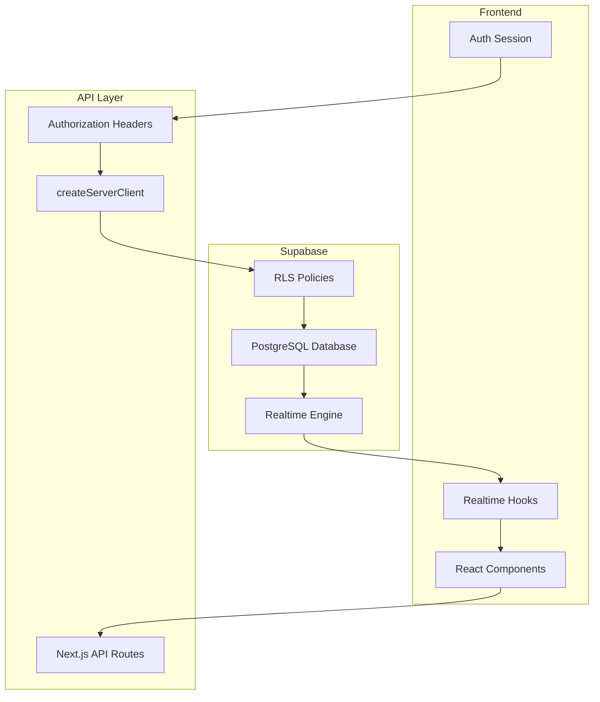

# 🛡️ Supabase CRUD 개발 완전 가이드

## 📋 목차
1. [개요](#1-개요)
2. [Supabase 기본 설정](#2-supabase-기본-설정)
3. [RLS 정책 설정](#3-rls-정책-설정)
4. [API 라우트 개발](#4-api-라우트-개발)
5. [컴포넌트 개발](#5-컴포넌트-개발)
6. [실시간 동기화](#6-실시간-동기화)
7. [에러 처리](#7-에러-처리)
8. [성능 최적화](#8-성능-최적화)
9. [테스트 가이드](#9-테스트-가이드)
10. [체크리스트](#10-체크리스트)

---

## 1. 개요

### 🎯 **핵심 원칙**
- **RLS 정책 기반 보안**: 모든 데이터 접근은 Row Level Security를 통해 제어
- **실시간 동기화**: Supabase Realtime으로 즉시 UI 반영
- **타입 안전성**: TypeScript + Supabase 타입 생성으로 런타임 에러 방지
- **표준화된 패턴**: 일관된 CRUD 패턴으로 개발 효율성 극대화

### 🏗️ **아키텍처 개요**


---

## 2. Supabase 기본 설정

### 📂 **환경 변수 설정**
```env
# .env.local
NEXT_PUBLIC_SUPABASE_URL=https://your-project.supabase.co
NEXT_PUBLIC_SUPABASE_ANON_KEY=your-anon-key
SUPABASE_SERVICE_ROLE_KEY=your-service-role-key
```

### 🔧 **Supabase 클라이언트 설정**
```typescript
// src/lib/supabase.ts
import { createClient as _createClient } from '@supabase/supabase-js';
import { Database } from '@/types/database';

const supabaseUrl = process.env.NEXT_PUBLIC_SUPABASE_URL || '';
const supabaseAnonKey = process.env.NEXT_PUBLIC_SUPABASE_ANON_KEY || '';

// 기본 클라이언트 (브라우저용)
export function createClient() {
  return _createClient<Database>(supabaseUrl, supabaseAnonKey, {
    auth: {
      persistSession: true,
      autoRefreshToken: true,
    },
  });
}

// 서버용 클라이언트 (Authorization 헤더 포함)
export function createServerClient(accessToken?: string) {
  return _createClient<Database>(supabaseUrl, supabaseAnonKey, {
    global: {
      headers: {
        ...(accessToken ? { Authorization: `Bearer ${accessToken}` } : {}),
        'X-Client-Info': 'money-management-app',
      },
    },
  });
}
```

### 📊 **타입 생성**
```bash
# Supabase CLI를 통한 타입 생성
npx supabase gen types typescript --project-id your-project-id > src/types/database.ts
```

---

## 3. RLS 정책 설정

### 🛡️ **표준 RLS 정책 패턴**

#### **1. 읽기 권한 (SELECT)**
```sql
-- 공개 읽기 (모든 사용자)
CREATE POLICY "Public read access" ON table_name
FOR SELECT USING (true);

-- 인증된 사용자만 읽기
CREATE POLICY "Authenticated read access" ON table_name
FOR SELECT USING (auth.role() = 'authenticated');
```

#### **2. 생성 권한 (INSERT)**
```sql
-- 공개 생성
CREATE POLICY "Public insert access" ON table_name
FOR INSERT WITH CHECK (true);

-- 인증된 사용자만 생성
CREATE POLICY "Authenticated insert access" ON table_name
FOR INSERT WITH CHECK (auth.role() = 'authenticated');
```

#### **3. 수정 권한 (UPDATE)**
```sql
-- 인증된 사용자만 수정 (필수)
CREATE POLICY "Allow update for authenticated users" ON table_name
FOR UPDATE USING (auth.role() = 'authenticated');
```

#### **4. 삭제 권한 (DELETE)**
```sql
-- 인증된 사용자만 삭제 (필수)
CREATE POLICY "Allow delete for authenticated users" ON table_name
FOR DELETE USING (auth.role() = 'authenticated');
```

### ⚠️ **중요 규칙**
- **UPDATE/DELETE는 반드시 `auth.role() = 'authenticated'` 조건 필요**
- **RLS 활성화**: `ALTER TABLE table_name ENABLE ROW LEVEL SECURITY;`
- **정책 이름 표준화**: 일관된 명명 규칙 사용

---

## 4. API 라우트 개발

### 📁 **디렉토리 구조**
```
src/app/api/
├── table-name/
│   └── route.ts        # GET, POST, PATCH, DELETE
└── table-name/
    ├── route.ts
    └── [id]/
        └── route.ts    # 개별 항목 처리
```

### 🔧 **표준 API 라우트 템플릿**

```typescript
// src/app/api/table-name/route.ts
import { NextRequest, NextResponse } from 'next/server'
import { createClient, createServerClient } from '@/lib/supabase'

// ✅ GET: 목록 조회 (인증 불필요)
export async function GET(req: NextRequest) {
  const supabase = createClient()
  const { searchParams } = new URL(req.url)
  const q = searchParams.get('q') || ''
  
  const { data, error } = await supabase
    .from('table_name')
    .select('*')
    .ilike('search_field', `%${q}%`)
    .order('created_at', { ascending: false })
    
  if (error) {
    return NextResponse.json({ error: error.message }, { status: 500 })
  }
  
  return NextResponse.json(data)
}

// ✅ POST: 새 항목 생성 (인증 불필요 - 비즈니스 로직에 따라)
export async function POST(req: NextRequest) {
  const supabase = createClient()
  const body = await req.json()
  
  // 입력 값 검증
  if (!body.required_field) {
    return NextResponse.json(
      { error: 'required_field is required' }, 
      { status: 400 }
    )
  }
  
  const { data, error } = await supabase
    .from('table_name')
    .insert([body])
    .select('id')
    .single()
    
  if (error) {
    return NextResponse.json({ error: error.message }, { status: 500 })
  }
  
  return NextResponse.json({ id: data.id })
}

// ✅ PATCH: 항목 수정 (인증 필수)
export async function PATCH(req: NextRequest) {
  // 1. Authorization 헤더에서 토큰 추출
  const authHeader = req.headers.get('authorization')
  const token = authHeader?.replace('Bearer ', '')
  
  if (!token) {
    return new NextResponse(
      JSON.stringify({ error: 'Authorization token required' }), 
      {
        status: 401,
        headers: { 'Cache-Control': 'no-store' }
      }
    )
  }
  
  // 2. 인증된 Supabase 클라이언트 생성
  const supabase = createServerClient(token)
  
  // 3. 요청 데이터 파싱 및 검증
  const { id, ...updateData } = await req.json()
  
  if (!id) {
    return new NextResponse(
      JSON.stringify({ error: 'id is required' }), 
      {
        status: 400,
        headers: { 'Cache-Control': 'no-store' }
      }
    )
  }
  
  // 4. 데이터베이스 업데이트 (RLS 정책 자동 적용)
  const { error, count } = await supabase
    .from('table_name')
    .update(updateData, { count: 'exact' })
    .eq('id', id)
    
  if (error) {
    return new NextResponse(
      JSON.stringify({ error: error.message }), 
      { status: 500, headers: { 'Cache-Control': 'no-store' } }
    )
  }
  
  if (!count) {
    return new NextResponse(
      JSON.stringify({ error: 'No row updated', affectedRows: 0 }), 
      { status: 404, headers: { 'Cache-Control': 'no-store' } }
    )
  }
  
  return new NextResponse(
    JSON.stringify({ success: true, affectedRows: count }), 
    { status: 200, headers: { 'Cache-Control': 'no-store' } }
  )
}

// ✅ DELETE: 항목 삭제 (인증 필수)
export async function DELETE(req: NextRequest) {
  // 1. Authorization 헤더에서 토큰 추출
  const authHeader = req.headers.get('authorization')
  const token = authHeader?.replace('Bearer ', '')
  
  if (!token) {
    return new NextResponse(
      JSON.stringify({ error: 'Authorization token required' }), 
      {
        status: 401,
        headers: { 'Cache-Control': 'no-store' }
      }
    )
  }
  
  // 2. 인증된 Supabase 클라이언트 생성
  const supabase = createServerClient(token)
  
  // 3. 요청 데이터 파싱 및 검증
  const { id } = await req.json()
  
  if (!id) {
    return new NextResponse(
      JSON.stringify({ error: 'id is required' }), 
      {
        status: 400,
        headers: { 'Cache-Control': 'no-store' }
      }
    )
  }
  
  // 4. 데이터베이스 삭제 (RLS 정책 자동 적용)
  const { error, count } = await supabase
    .from('table_name')
    .delete({ count: 'exact' })
    .eq('id', id)
    
  if (error) {
    return new NextResponse(
      JSON.stringify({ error: error.message }), 
      { status: 500, headers: { 'Cache-Control': 'no-store' } }
    )
  }
  
  if (!count) {
    return new NextResponse(
      JSON.stringify({ error: 'No row deleted', affectedRows: 0 }), 
      { status: 404, headers: { 'Cache-Control': 'no-store' } }
    )
  }
  
  return new NextResponse(
    JSON.stringify({ success: true, affectedRows: count }), 
    { status: 200, headers: { 'Cache-Control': 'no-store' } }
  )
}
```

### 🔑 **핵심 포인트**
1. **createServerClient(token)**: Authorization 헤더 토큰을 직접 전달
2. **count: 'exact'**: 영향받은 행 수 정확히 반환
3. **Cache-Control: 'no-store'**: 캐시 방지로 실시간성 보장
4. **일관된 에러 응답**: 표준화된 에러 형식

---

## 5. 컴포넌트 개발

### 🎯 **표준 CRUD 컴포넌트 패턴**

#### **1. 실시간 데이터 훅**
```typescript
// src/lib/useTableRealtime.ts
import { useState, useEffect } from 'react'
import { supabase } from '@/lib/supabase'

export function useTableRealtime() {
  const [data, setData] = useState<any[]>([])
  
  useEffect(() => {
    // 초기 데이터 로드
    const fetchData = async () => {
      const { data: initialData } = await supabase
        .from('table_name')
        .select('*')
        .order('created_at')
      setData(initialData || [])
    }
    
    fetchData()
    
    // 실시간 구독
    const subscription = supabase
      .channel('table_name_changes')
      .on('postgres_changes', 
        { event: '*', schema: 'public', table: 'table_name' },
        (payload) => {
          if (payload.eventType === 'INSERT') {
            setData(prev => [...prev, payload.new])
          } else if (payload.eventType === 'UPDATE') {
            setData(prev => prev.map(item => 
              item.id === payload.new.id ? payload.new : item
            ))
          } else if (payload.eventType === 'DELETE') {
            setData(prev => prev.filter(item => item.id !== payload.old.id))
          }
        }
      )
      .subscribe()
    
    return () => {
      subscription.unsubscribe()
    }
  }, [])
  
  return data
}
```

#### **2. CRUD 관리 컴포넌트**
```typescript
// src/components/table-manager.tsx
import { useState, useEffect } from 'react'
import { useTableRealtime } from '@/lib/useTableRealtime'
import { supabase } from '@/lib/supabase'

export default function TableManager() {
  const data = useTableRealtime()
  const [editRows, setEditRows] = useState<Record<string, any>>({})
  const [newItem, setNewItem] = useState({ field1: '', field2: '' })
  const [message, setMessage] = useState('')
  const [session, setSession] = useState<any>(null)

  // 세션 관리
  useEffect(() => {
    supabase.auth.getSession().then(res => setSession(res.data.session))
    const { data: listener } = supabase.auth.onAuthStateChange((_event, session) => {
      setSession(session)
    })
    return () => { listener?.subscription.unsubscribe() }
  }, [])

  // 편집 상태 관리
  function getRowState(row: any) {
    return editRows[row.id] || { 
      isEditing: false, 
      editField1: row.field1, 
      editField2: row.field2 
    }
  }

  function setRowState(row: any, state: any) {
    setEditRows(prev => ({ 
      ...prev, 
      [row.id]: { ...getRowState(row), ...state } 
    }))
  }

  // ✅ 추가 함수
  async function handleAdd() {
    if (!newItem.field1 || !newItem.field2) {
      return setMessage('모든 필드를 입력하세요')
    }
    
    const res = await fetch('/api/table-name', {
      method: 'POST',
      headers: { 'Content-Type': 'application/json' },
      body: JSON.stringify(newItem)
    })
    
    if (res.ok) {
      setNewItem({ field1: '', field2: '' })
      setMessage('추가 완료')
    } else {
      const error = await res.json()
      setMessage('추가 실패: ' + (error?.error || res.status))
    }
  }

  // ✅ 수정 함수
  async function handleSave(row: any) {
    const state = getRowState(row)
    
    if (!session) {
      setMessage('로그인 후 이용 가능합니다')
      return
    }
    
    const accessToken = session?.access_token || ''
    
    try {
      const res = await fetch('/api/table-name', {
        method: 'PATCH',
        headers: {
          'Content-Type': 'application/json',
          'Authorization': `Bearer ${accessToken}`
        },
        body: JSON.stringify({
          id: row.id,
          field1: state.editField1,
          field2: state.editField2
        })
      })
      
      if (res.ok) {
        setMessage('수정 완료')
        setRowState(row, { isEditing: false })
      } else {
        const error = await res.json()
        setMessage('수정 실패: ' + (error?.error || res.status))
      }
    } catch (e) {
      setMessage('수정 실패: ' + (e instanceof Error ? e.message : String(e)))
    }
  }

  // ✅ 삭제 함수
  async function handleDelete(id: string) {
    if (!session) {
      setMessage('로그인 후 이용 가능합니다')
      return
    }
    
    if (!confirm('정말 삭제하시겠습니까?')) return
    
    const accessToken = session?.access_token || ''
    
    try {
      const res = await fetch('/api/table-name', {
        method: 'DELETE',
        headers: {
          'Content-Type': 'application/json',
          'Authorization': `Bearer ${accessToken}`
        },
        body: JSON.stringify({ id })
      })
      
      if (res.ok) {
        setMessage('삭제 완료')
      } else {
        const error = await res.json()
        setMessage('삭제 실패: ' + (error?.error || res.status))
      }
    } catch (e) {
      setMessage('삭제 실패: ' + (e instanceof Error ? e.message : String(e)))
    }
  }

  return (
    <div className="space-y-4">
      <h2 className="text-2xl font-bold">📊 테이블 관리</h2>
      
      {message && (
        <div className="text-lg text-blue-600 bg-blue-50 p-4 rounded-lg">
          {message}
        </div>
      )}
      
      {/* 데이터 테이블 */}
      <div className="overflow-auto max-h-96">
        <table className="w-full border-collapse border border-gray-300">
          <thead>
            <tr className="bg-blue-100">
              <th className="border border-gray-300 p-3 text-lg font-bold">필드1</th>
              <th className="border border-gray-300 p-3 text-lg font-bold">필드2</th>
              <th className="border border-gray-300 p-3 text-lg font-bold">수정</th>
              <th className="border border-gray-300 p-3 text-lg font-bold">삭제</th>
            </tr>
          </thead>
          <tbody>
            {data.map((row) => {
              const state = getRowState(row)
              return (
                <tr key={row.id} className="hover:bg-blue-50">
                  <td className="border border-gray-300 p-3">
                    {state.isEditing ? (
                      <input
                        className="w-full p-2 text-lg border rounded"
                        value={state.editField1}
                        onChange={(e) => setRowState(row, { editField1: e.target.value })}
                      />
                    ) : (
                      <span className="text-lg">{row.field1}</span>
                    )}
                  </td>
                  <td className="border border-gray-300 p-3">
                    {state.isEditing ? (
                      <input
                        className="w-full p-2 text-lg border rounded"
                        value={state.editField2}
                        onChange={(e) => setRowState(row, { editField2: e.target.value })}
                      />
                    ) : (
                      <span className="text-lg">{row.field2}</span>
                    )}
                  </td>
                  <td className="border border-gray-300 p-3 text-center">
                    {state.isEditing ? (
                      <div className="space-x-2">
                        <button
                          onClick={() => handleSave(row)}
                          className="px-4 py-2 bg-green-600 text-white rounded hover:bg-green-700 text-lg"
                        >
                          💾 저장
                        </button>
                        <button
                          onClick={() => setRowState(row, { isEditing: false })}
                          className="px-4 py-2 bg-gray-500 text-white rounded hover:bg-gray-600 text-lg"
                        >
                          ❌ 취소
                        </button>
                      </div>
                    ) : (
                      <button
                        onClick={() => setRowState(row, { isEditing: true })}
                        className="px-4 py-2 bg-blue-600 text-white rounded hover:bg-blue-700 text-lg"
                      >
                        ✏️ 수정
                      </button>
                    )}
                  </td>
                  <td className="border border-gray-300 p-3 text-center">
                    <button
                      onClick={() => handleDelete(row.id)}
                      className="px-4 py-2 bg-red-600 text-white rounded hover:bg-red-700 text-lg"
                    >
                      🗑️ 삭제
                    </button>
                  </td>
                </tr>
              )
            })}
          </tbody>
        </table>
      </div>
      
      {/* 새 항목 추가 */}
      <div className="bg-blue-50 p-6 rounded-lg">
        <h3 className="text-xl font-bold mb-4">➕ 새 항목 추가</h3>
        <div className="grid grid-cols-1 md:grid-cols-3 gap-4">
          <input
            className="p-3 text-lg border rounded"
            placeholder="필드1"
            value={newItem.field1}
            onChange={(e) => setNewItem(prev => ({ ...prev, field1: e.target.value }))}
          />
          <input
            className="p-3 text-lg border rounded"
            placeholder="필드2"
            value={newItem.field2}
            onChange={(e) => setNewItem(prev => ({ ...prev, field2: e.target.value }))}
          />
          <button
            onClick={handleAdd}
            className="px-6 py-3 bg-green-600 text-white rounded hover:bg-green-700 text-lg font-bold"
          >
            ➕ 추가
          </button>
        </div>
      </div>
    </div>
  )
}
```

---

## 6. 실시간 동기화

### ⚡ **Supabase Realtime 설정**

#### **1. 테이블에 Realtime 활성화**
```sql
-- Supabase 대시보드에서 실행
ALTER publication supabase_realtime ADD TABLE table_name;
```

#### **2. 실시간 훅 패턴**
```typescript
export function useRealtimeTable() {
  const [data, setData] = useState([])
  
  useEffect(() => {
    // 실시간 구독 설정
    const subscription = supabase
      .channel('table_changes')
      .on('postgres_changes', 
        { event: '*', schema: 'public', table: 'table_name' },
        handleRealtimeChange
      )
      .subscribe()
    
    return () => subscription.unsubscribe()
  }, [])
  
  const handleRealtimeChange = (payload: any) => {
    switch (payload.eventType) {
      case 'INSERT':
        setData(prev => [...prev, payload.new])
        break
      case 'UPDATE':
        setData(prev => prev.map(item => 
          item.id === payload.new.id ? payload.new : item
        ))
        break
      case 'DELETE':
        setData(prev => prev.filter(item => item.id !== payload.old.id))
        break
    }
  }
}
```

---

## 7. 에러 처리

### 🚨 **표준 에러 처리 패턴**

#### **1. API 에러 응답**
```typescript
// 표준 에러 응답 형식
const errorResponse = {
  error: string,          // 에러 메시지
  code?: string,          // 에러 코드
  details?: any,          // 상세 정보
  affectedRows?: number   // 영향받은 행 수
}
```

#### **2. 클라이언트 에러 처리**
```typescript
async function handleApiRequest() {
  try {
    const res = await fetch('/api/endpoint', { ... })
    
    if (!res.ok) {
      const error = await res.json()
      throw new Error(error.error || `HTTP ${res.status}`)
    }
    
    const data = await res.json()
    return { success: true, data }
    
  } catch (error) {
    console.error('API 요청 실패:', error)
    return { 
      success: false, 
      error: error instanceof Error ? error.message : String(error) 
    }
  }
}
```

---

## 8. 성능 최적화

### 🚀 **최적화 전략**

#### **1. 인덱스 생성**
```sql
-- 검색 필드에 인덱스 생성
CREATE INDEX idx_table_search ON table_name(search_field);
CREATE INDEX idx_table_created_at ON table_name(created_at);
```

#### **2. 페이지네이션**
```typescript
// API에서 페이지네이션 지원
const { data, count } = await supabase
  .from('table_name')
  .select('*', { count: 'exact' })
  .range(from, to)
  .order('created_at', { ascending: false })
```

#### **3. 선택적 필드 로드**
```typescript
// 필요한 필드만 선택
const { data } = await supabase
  .from('table_name')
  .select('id, essential_field1, essential_field2')
```

---

## 9. 테스트 가이드

### 🧪 **테스트 체크리스트**

#### **1. RLS 정책 테스트**
- [ ] 비인증 사용자의 UPDATE/DELETE 차단 확인
- [ ] 인증된 사용자의 정상 CRUD 동작 확인
- [ ] Authorization 헤더 누락 시 401 에러 확인

#### **2. API 엔드포인트 테스트**
- [ ] GET: 목록 조회 정상 동작
- [ ] POST: 새 항목 생성 정상 동작
- [ ] PATCH: 항목 수정 정상 동작 (인증 필요)
- [ ] DELETE: 항목 삭제 정상 동작 (인증 필요)

#### **3. 실시간 동기화 테스트**
- [ ] 추가 시 실시간 UI 반영
- [ ] 수정 시 실시간 UI 반영
- [ ] 삭제 시 실시간 UI 반영

#### **4. 에러 처리 테스트**
- [ ] 잘못된 데이터 입력 시 적절한 에러 메시지
- [ ] 네트워크 오류 시 에러 처리
- [ ] 권한 없음 시 401 에러 표시

---

## 10. 체크리스트

### ✅ **개발 전 체크리스트**

#### **데이터베이스 설정**
- [ ] 테이블 스키마 정의 완료
- [ ] RLS 정책 설정 완료 (UPDATE/DELETE는 authenticated 필수)
- [ ] Realtime 활성화 완료
- [ ] 필요한 인덱스 생성 완료

#### **타입 안전성**
- [ ] Supabase 타입 생성 완료 (`npx supabase gen types`)
- [ ] TypeScript 타입 정의 확인
- [ ] 스키마 변경 시 타입 재생성

#### **API 라우트**
- [ ] `createServerClient(token)` 사용 (PATCH/DELETE)
- [ ] Authorization 헤더 토큰 검증
- [ ] 적절한 에러 응답 설정
- [ ] `count: 'exact'` 옵션 사용

#### **컴포넌트**
- [ ] 실시간 훅 구현
- [ ] 세션 관리 구현
- [ ] 에러 처리 구현
- [ ] 사용자 친화적 UI 구현

### ✅ **배포 전 체크리스트**

#### **보안**
- [ ] RLS 정책 테스트 완료
- [ ] 환경 변수 설정 확인
- [ ] API 키 보안 확인

#### **성능**
- [ ] 페이지네이션 구현 (대용량 데이터)
- [ ] 불필요한 필드 제거
- [ ] 캐싱 전략 적용

#### **테스트**
- [ ] CRUD 기능 모든 시나리오 테스트
- [ ] 실시간 동기화 테스트
- [ ] 에러 상황 테스트
- [ ] 다중 사용자 동시 접근 테스트

---

## 🎯 **마무리**

이 가이드를 따라 개발하면:

1. **✅ 보안**: RLS 정책으로 데이터 보안 보장
2. **✅ 실시간**: 즉시 UI 반영으로 사용자 경험 극대화
3. **✅ 안정성**: 타입 안전성과 표준화된 에러 처리
4. **✅ 확장성**: 일관된 패턴으로 유지보수 용이
5. **✅ 성능**: 최적화된 쿼리와 실시간 동기화

**핵심은 `createServerClient(token)`를 통한 RLS 정책 호환성입니다!** 🚀

---

## 📚 **참고 자료**

- [Supabase RLS 가이드](https://supabase.com/docs/guides/auth/row-level-security)
- [Supabase Realtime](https://supabase.com/docs/guides/realtime)
- [Next.js API Routes](https://nextjs.org/docs/app/building-your-application/routing/route-handlers)
- [TypeScript Supabase](https://supabase.com/docs/guides/api/rest/generating-types) 