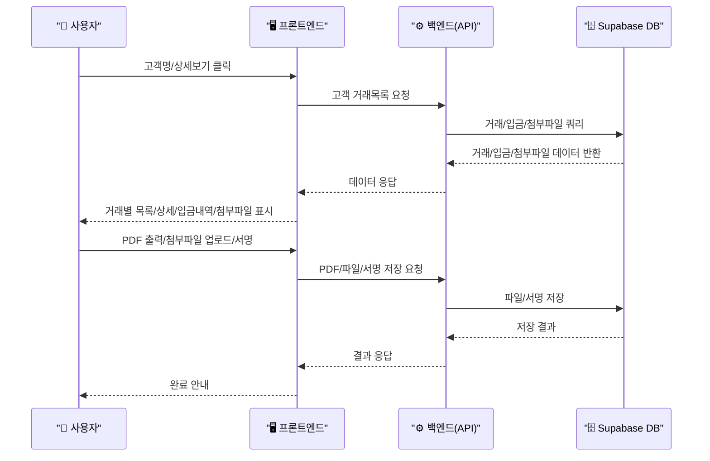

# 거래상세 페이지 PRD (Product Requirements Document)

## 1. 진입 및 네비게이션
- 거래관리 페이지에서 고객명 클릭 또는 상세보기 버튼 클릭 시 거래상세 페이지로 이동

## 2. 거래별 목록(상단)
- 해당 고객의 모든 거래건을 날짜순/최신순으로 상단에 리스트(탭/버튼/슬라이드 등)로 표시
- 거래 클릭 시 해당 거래의 상세정보 표시

## 3. 거래 상세정보
- 필수 컬럼:
  - 고객명, 거래일자, 거래유형(판매/수리 등), 기종, 모델, 매출액, 입금액, 잔금, 입금율(%), 기타(비고)
- 입금내역:
  - 거래별 입금내역을 표로 상세하게 표시
  - 예: 2025-03-05, 정현목, 농협, 123-456-789, 500,000원, 입금자: 홍길동
  - 여러 건 입금 시 모두 표시
  - **현금입금의 경우**: 반드시 아래 항목을 상세히 기록
    - 입금일시, 입금장소(공장/농가/기타), 입금자, 금액, 수단(만원권/오만원권/수표/상품권/기타), **수령자(누가 받았는지)**, 비고 등
    - 예: 2025-03-10, 공장, 홍길동, 1,000,000원, 오만원권 10장, 수령자: 김철수, 비고: 현장수령

## 4. 거래 일자별 정리
- 거래내역을 일자별로 그룹핑/정렬하여 표시

## 5. PDF 출력
- 거래상세 내역을 PDF로 출력할 수 있는 버튼/폼 제공
- 인쇄 미리보기 및 다운로드 지원

## 6. 증빙서류 첨부
- 첨부서류 항목(총 11종, 각 5건 제한)
  1. 계약서
  2. 융자서류
  3. 입금표
  4. 채권확인서
  5. 내용증명
  6. 약속서류
  7. 기타서류
  8. 신분증 사본
  9. 사업자등록증
  10. 등기부등본
  11. 세금계산서/영수증
- 각 항목별 최대 5건까지 업로드 가능(프론트+백엔드 이중 제한)
- 거래유형별 필수/선택 첨부서류 구분(옵션화 가능, 예: 융자거래 시 융자서류 필수)
- 파일(이미지, PDF 등) 첨부 및 미리보기, 업로드/삭제/다운로드 기능
- 첨부파일 유형별 색상/아이콘 구분, 필수 항목 시각적 강조

## 7. 모바일/반응형 & 서명
- 모바일 환경에서 최적화된 UI 제공
- 고객 미수금 확인 시, 직접 서명(터치) 받아 저장(이미지/PDF 첨부)

---

## 아키텍처 다이어그램

```mermaid
graph TB
    subgraph "🖥️ 거래관리"
        A[고객별 요약 테이블]
        B[상세보기 버튼/고객명 클릭]
    end
    subgraph "📄 거래상세 페이지"
        C[거래별 목록(상단)]
        D[거래 상세 카드/테이블]
        E[입금내역 상세]
        F[증빙서류 첨부]
        G[PDF 출력폼]
        H[모바일 서명]
    end
    A -- 클릭/상세보기 --> C
    C -- 거래선택 --> D
    D -- 입금내역 --> E
    D -- 증빙서류 --> F
    D -- PDF출력 --> G
    D -- 모바일서명 --> H
```

---

## 데이터 흐름 시퀀스



---

## UI/UX 특징
- 상단 거래목록: 탭/슬라이드/버튼 등으로 빠른 전환
- 상세정보: 카드형/테이블형, 컬럼별 강조
- 입금내역: 표+입금자/계좌/일자/금액 등 구체적 표시
- 첨부파일: 11개 항목별 탭/섹션(또는 드롭다운), 각 5건 제한, 썸네일/미리보기/다운로드/삭제, 업로드 상태/에러 안내
- 첨부유형별 색상/아이콘, 필수/선택 구분(별표, 강조색 등)
- PDF: 인쇄 미리보기, 모바일 최적화
- 서명: 터치 서명패드, 저장/첨부

---

## 기술적 구현 예시

```typescript
// 거래상세 데이터 fetch 예시
const { data: transactions } = await supabase
  .from('transactions')
  .select(`
    *, 
    payments(*), 
    files(type, url)
  `)
  .eq('customer_id', customerId)
  .order('created_at', { ascending: false });

// 첨부파일 메타데이터 예시
const { data: attachments } = await supabase
  .from('transaction_attachments')
  .select('*')
  .eq('transaction_id', transactionId)
  .order('uploaded_at', { ascending: false });

// 업로드 제한 체크(프론트)
if (attachments.filter(a => a.type === '계약서').length >= 5) {
  alert('계약서는 최대 5건까지 첨부할 수 있습니다.');
}

// 업로드 API 예시
const { data, error } = await supabase.storage
  .from('transaction-attachments')
  .upload(`${transactionId}/${type}/${file.name}`, file);
```

---

## 성능/확장성
- 거래/입금/첨부 쿼리 최적화 (필드 제한, 인덱스 활용)
- PDF 생성은 클라이언트/서버 모두 지원
- 파일 업로드는 Supabase Storage 연동
- 모바일/PC 반응형 레이아웃

---

## 체크리스트
- [x] 거래별 목록/상세/입금내역/첨부파일/서명/출력 모두 포함
- [x] 반응형/모바일/PC 지원
- [x] 실DB 연동 및 확장성 고려 